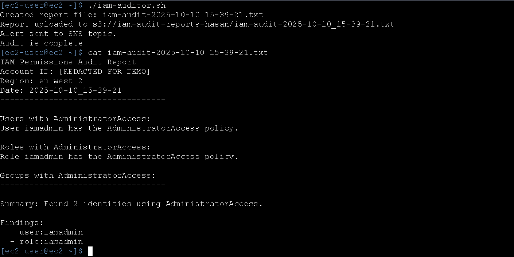
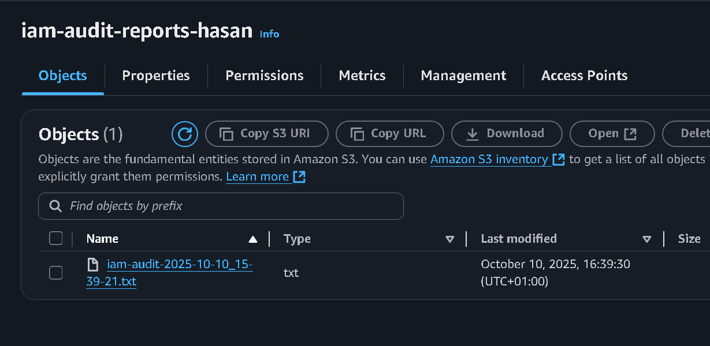
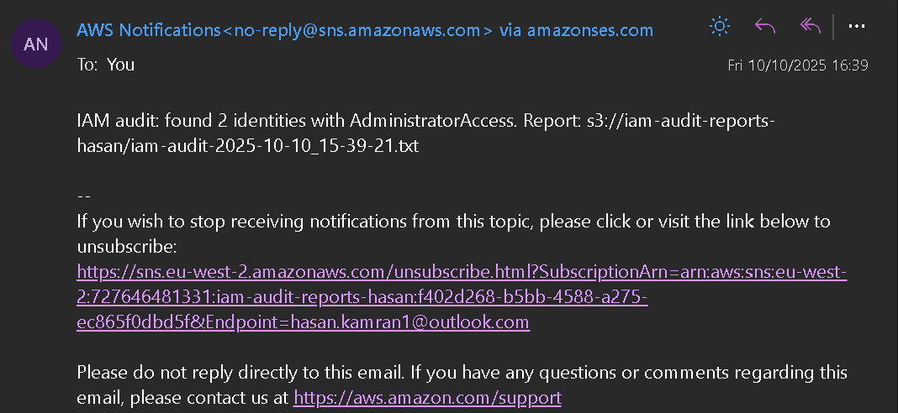

# IAM Permissions Auditor


A Bash-based auditing tool that scans an AWS account for **users, roles, and groups** with `AdministratorAccess`.  
When executed, it performs an audit, uploads a detailed report to **S3** and sends an **SNS email alert** if any high-privilege identities are found.

---

## Purpose

Automatically identify excessive IAM permissions to support the **principle of least privilege** across AWS environments.

---

## AWS Services Used

| Service | Purpose |
|----------|----------|
| **IAM** | Lists users, roles, and groups with attached policies |
| **STS** | Verifies account identity and credentials |
| **S3** | Stores generated audit reports |
| **SNS** | Sends email alerts when risks are detected |
| **EC2** | Runs the script securely using an IAM instance role |

---

## Project Preview

**Terminal Output**


**S3 Bucket (Report Storage)**  


**SNS Topic Configuration**  


**Email Alert from SNS**  


---

## Skills Demonstrated

- AWS Identity and Access Management (IAM)  
- Bash scripting and automation  
- Secure role-based execution on EC2  
- Error handling and audit reporting  

---

## Repository Structure

```
iam-permissions-auditor/
├── iam.sh
├── assets/
│ ├── iam-audit.gif
│ ├── s3-bucket.png
│ ├── sns-topic.png
│ └── sns-email.png
├── policies/
│ └── iam-auditor-inline.json
└── README.md
